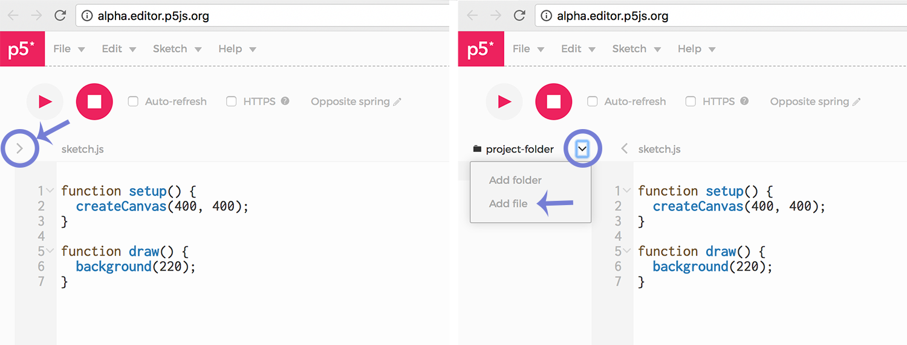

In this lab, you will use serial communication to send at least two sensor values from Arduino to [P5JS](https://p5js.org). Using P5, you must create an interactive, visual output from the incoming sensor data.

**Lab Objectives:**

+ Explore serial communication between Arduino and P5
+ Learn how to appropriately format data to send between devices
+ Build an interface using P5

**Lab 6 Resources:**

+ [Serial Output from Arduino to P5 as Binary](https://vimeo.com/237203208)
+ [Serial Output as ASCII](https://vimeo.com/239025399)

*Hint: use these video resources!!!*

 

**The Arduino Side:**

Build a circuit with two analog sensors. Print the values to the Serial Monitor in Arduino to ensure that you are getting good values.

You will be sending these values serially to Processing, and since you are sending multiple values, you should send your data as an ASCII string and parse the data in P5. Pay attention to how you format your data in the Serial Monitor before moving to P5.

**The Processing Side:**

In order for Arduino to talk to P5, you will need to install the [p5.seriacontrol](https://github.com/vanevery/p5.serialcontrol/releases) App. This little app makes our life easier by establishing communication between the serial port and the web browser. You can also run p5.serialserver in the commandline, there are notes about how to do that [here](https://itp.nyu.edu/physcomp/labs/labs-serial-communication/lab-serial-input-to-the-p5-js-ide/).

Once you've downloaded the p5.serialcontrol App, you're ready to make a sketch. I suggest using the [p5 web editor](http://alpha.editor.p5js.org/). You will also need to download this file: [p5.serialport.js](https://raw.githubusercontent.com/vanevery/p5.serialport/master/lib/p5.serialport.js). Add it to your sketch by clicking the file navigation arrow on the left of the screen, then click the down arrow to add files. Choose the downloaded p5.serialport.js file and upload it to your sketch.

Connect to the Serial Port that your Arduino is sending data to, read and parse the values into P5.

Design an interface using P5 - a visual output of data from your Arduino circuit. Simple is okay, just focus on building something responsive and intuitive.

***Lab 8 is due before class on Tuesday October 31st***

Your blog response should include a *clear* video of what you made (show both the Arduino and P5 side), a schematic diagram, a brief written description of what you made, and all of your code embedded with GitHub Gist. Submit a link to your blog post on D2L.
