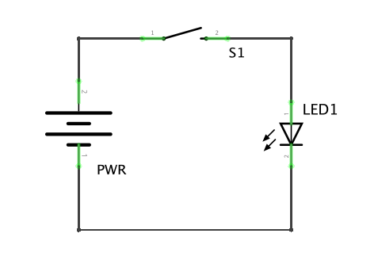
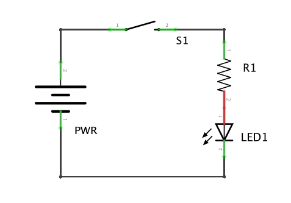
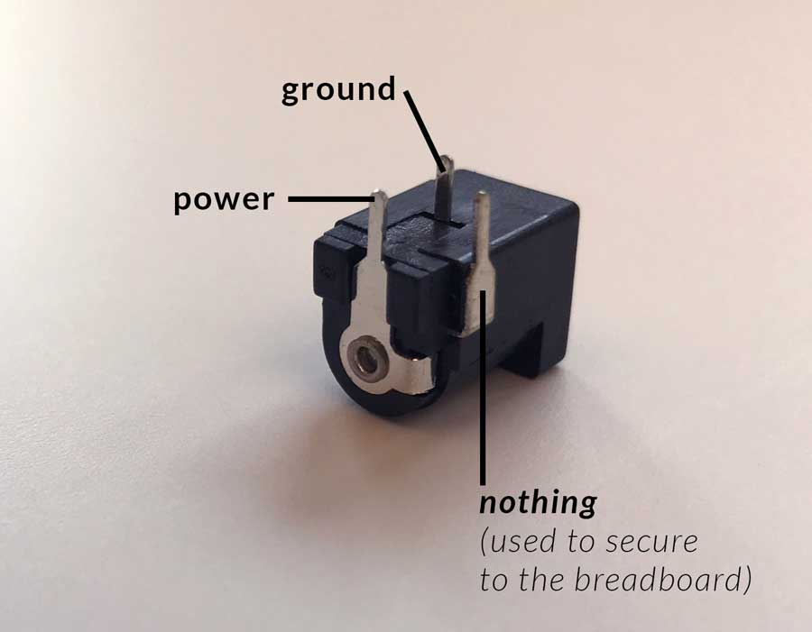

In this lab, you will build the same circuit twice - once on paper using copper tape, and once on a breadboard. The goal of this lab is to become familiar with building simple circuits. You will practice calculating resistor values based on the power source and components you are using, and you will construct a creative enclosure for your hardware.

#### Tasks:

1. Build the circuit (listed below) on paper using copper tape and a coin cell battery
2. Build the same circuit on a breadboard using a 9V battery or a power supply (between 5-12V)
3. Build a **creative enclosure** for one of your LED circuits (I highly suggest using cardboard, or extending your paper circuit)
4. Document what you made and post it to your blog. Be sure you have submitted a link to your blog  [here](https://docs.google.com/forms/d/e/1FAIpQLSdkvOkhTp1FimNm-o8jbxRfl2gip6AkCOmc4AGznV8-oRE06w/viewform?usp=sf_link)

#### Lab 1 Resources:

+ Sparkfun's [how to use a breadboard](https://learn.sparkfun.com/tutorials/how-to-use-a-breadboard) and ITP's [setting up a breadboard](https://itp.nyu.edu/physcomp/labs/labs-electronics/breadboard/)
+ [ITP's Electronics Lab](https://itp.nyu.edu/physcomp/labs/labs-electronics/electronics/) - scroll down to the 'basic LED circuit' section
+ [LED Current](https://vimeo.com/album/2801639/video/78674965)
<!-- + [What is a Voltage Regulator](https://itp.nyu.edu/physcomp/labs/labs-electronics/components/) -->

#### For this lab you will need the following parts:

+ Copper Tape
+ Coin Cell Battery
+ A few LEDs
+ Solderless Breadboard and hookup wire
+ A switch
+ Resistor (you will need to calculate the value based on your power supply)
+ Barrel Jack to Breadboard connector
+ Battery or Power Supply (between 5-12V)

#### Copper Tape Circuit

Build a simple circuit using copper tape that uses a switch to turn an LED on and off. Power your circuit with a coin cell battery.

#### Breadboarded Circuit

Build the same circuit, this time on a breadboard. Use a 9V battery or a wall adapter between 5-12V for power. In this circuit you must use a resistor to protect your LED from burning out. Use Ohm's Law to calculate the resistor value based on your power supply and LED.

<!-- Here's the pinout for the barrel jack connector: -->

<!--  -->

#### Blog Response:

+ Post a short written description of what you created in this Lab and post *clear* photos of both the process and the final result
+ Briefly describe your goals for this class

#### Lab 1 is due before class on September 5th

Complete your blog post prior to class, and bring in what you made.
