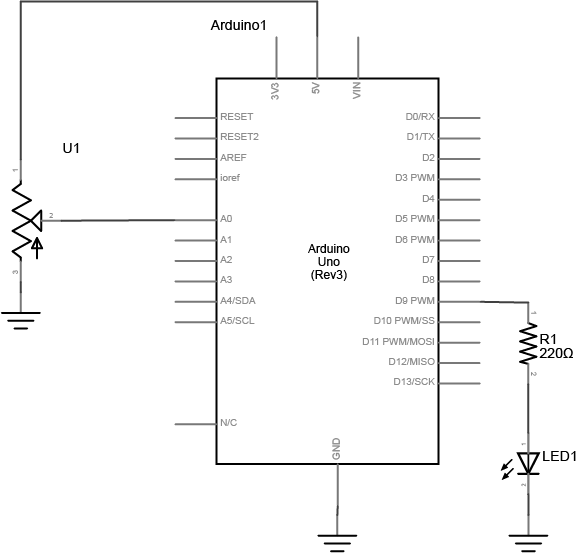
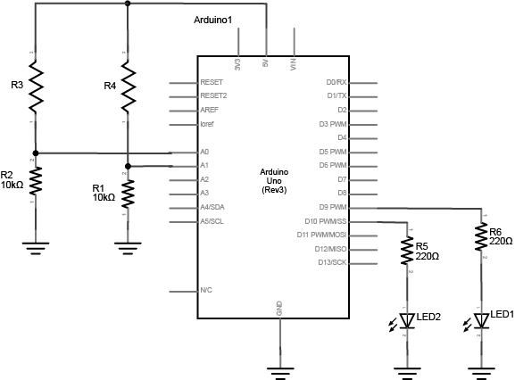
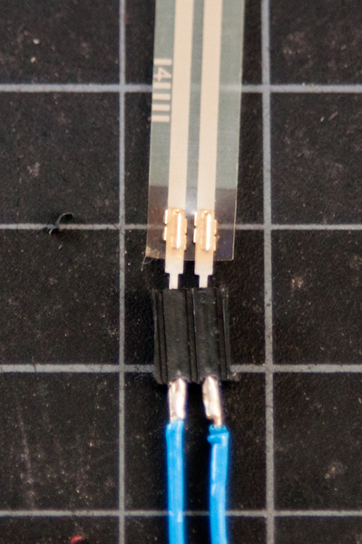
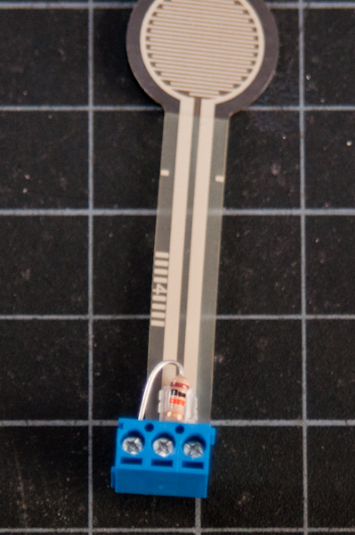
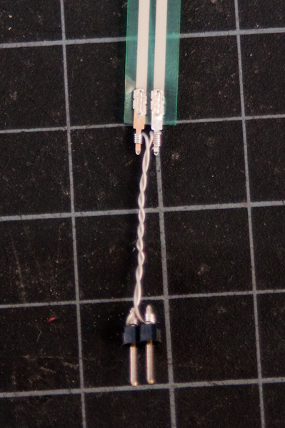

Lab 4 explores analog input and output using variable resistors. You will learn to read sensor values to the serial monitor and vary the brightness of LED lights using pulse width modulation (PWM).

**Lab Objectives:**

+ Read Analog sensor values using `analogRead()`
+ Print sensor values to the serial monitor
+ Use `analogWrite` on a PWM pin to dim an LED
+ Learn to fit an analog input reading into a single byte using the `map()` function

**Lab 4 Resources:**

+ Videos: [Analog Input 1](https://vimeo.com/86551311) and [Analog Input 2](https://vimeo.com/90534361)
+ Adafruit's guide to [Forse Sensitive Resistors (FSR)](https://learn.adafruit.com/force-sensitive-resistor-fsr)

**Parts:**

+ Solderless Breadboard and hookup wire
+ Sparkfun Redboard & USB connector
+ LEDs of different colors
+ Current limiting resistors for LEDs (calculate an appropriate value)
+ 10 Kohm resistors
+ 10 Kohm potentiometer
+ 2 Variable Resistors

**Part 1: Potentiometers**

Build a circuit with a potentiometer as the input, and an LED as the output. Use [`analogRead()`](https://www.arduino.cc/en/Reference/AnalogRead) for the incoming potentiometer value, and [`analogWrite()`](https://www.arduino.cc/en/Reference/AnalogWrite) to set the brightness of the LED.

**Setup the breadboard**   Connect a potentiometer to analog in pin 0 of the module, and an LED and a resistor to digital pin 9:

 

  

**Program the Module**

First, establish some global variables at the top of the program -
<pre>

	// declare a global constant
	// give the LED pin numbers a name

	// declare an int to hold the pot value

	// declare int for brightness value
	// used for writing PWM to LED

</pre>

In the setup() method -

<pre>
	void setup() {

	    // initialize serial

	    // set led pin as an output

	}
</pre>

In the main loop -
read the analog value using analogRead() and put the result into the variable that holds the analog value. Then divide the analog value by 4 to get it into a range from 0 to 255. Then use the analogWrite() command to face the LED. Finally, print out the brightness value to the serial monitor.

<pre>
	void loop() {

		//read value from the pot
		//put results into analogValue

		//fit analogValue into a byte
		//this is the brightness

		//PWM the LED with the
		//use brightness value

		//print brightness to serial monitor
	}
</pre>

When you run this code, the LED should dim up and down as you turn the pot, and the brightness value should show up in the serial monitor.

 

**Part 2: Other Variable Resistors**

Build a circuit with at least 2 different variable resistors that output brightness values to two different colored LEDs. ***You should not use a potentiometer for this part.***

Build two voltage divider circuits that connect to A0 and A1, using ***variable resistors*** for R3 and R4 (try a photocell or an FSR). To both pin 9 and 10, connect a resistor + LED. Use different colors for LED1 and LED2.

 

  

The circuit above works for any **variable resistor**. It’s called a voltage divider. There are two voltage dividers, one on analog in 0 and one on analog in 1. The fixed resistor in each circuit should have the same order of magnitude as the variable resistor’s range. For example, if you’re using a flex sensor with a range of 50 – 100 kilohms, you might use a 47Kohm or a 100Kohm fixed resistor. If you’re using a force sensing resistor that goes from infinity ohms to 10 ohms, but most of its range is between 10Kohms and 10 ohms, you might use a 10Kohm fixed resistor.

In Part 1, you used a potentiometer as input which always gives the full range of analog values, which is 0 to 1023. You can divide this value by 4 to get a range of 0 to 255, which is the full output range of the `analogWrite()` command.

A voltage divider circuit, on the other hand, can’t give you the full range. The fixed resistor in the circuit limits the range. You’ll need to modify the code or the resistor if you want a different range.

**Use the serial monitor to find your sensor range.** Then use the [`map()`](https://www.arduino.cc/en/Reference/Map) function to map the *actual* range that the sensor gives as input to the range that the LED needs as output.

 

*A Note on soldering sensor leads* - Flex sensors and force-sensing resistors melt easily, so unless you are *very* quick with a soldering iron, it’s risky to solder directly to their leads (you run the risk of ruining the component). Here are three better solutions:

1. Use female to male jumper cables
2. Use screw terminals (if you have a row of three you can attach the fixed resistor as well)
3. Use wire wrapping wire and a wire wrapping tool

&nbsp;&nbsp;&nbsp;
&nbsp;&nbsp;&nbsp;

***Lab 4 is due before class on Tuesday September 26th***

Your blog response should include a written explanation of what you did in this lab and a schematic and *clear* video of the working circuit for both parts of the lab. Still images may also be helpful for showing your breadboarded circuits up close. Be sure to include captions for your photos/videos/graphics.

Submit a link to your blog post on D2L.
