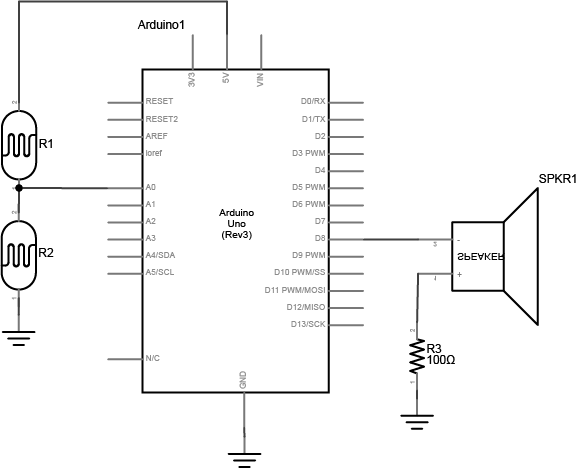

In this lab you will explore motors: servo, DC and Stepper motors. You will use the Arduino to generate a pseudo-analog output voltage, Pulse-width Modulation (PWM), to control a servo motor. You will learn to drive DC motors and Stepper motors using an H-Bridge.

**Lab Objectives:**

+ Use PWM to drive a servo motor

**Lab 5 Resources:**

+ [Meet the Motors (video)](https://vimeo.com/84274150)
+ [Analog Output – Motor Control](https://vimeo.com/93555504)
+ [Analog Output – Servo](https://vimeo.com/93608912)
+ [Tom Igoe's Notes on Steppers](http://www.tigoe.net/pcomp/code/circuits/motors/stepper-motors/)
+ [DC Motors: The Basics](https://itp.nyu.edu/physcomp/lessons/dc-motors/dc-motors-the-basics/)
+ [Controlling Stepper Motors](https://itp.nyu.edu/physcomp/lessons/dc-motors/stepper-motors/)
+ [H-Bridges (video)](https://vimeo.com/100357623)
+ [All About Steppers (video)](https://vimeo.com/101362995)
+ [Controlling a Unipolar Stepper Motor (video)](https://vimeo.com/102030557)

### Part 1: Servo Motor Control with an Arduino

**Supplies for Part 1**

+ Solderless Breadboard and hookup wire
+ Arduino microcontroller module & USB connector
+ 10Kohm resistors
+ Flex sensor (or a different form of variable resistor)
+ RC Servomotor

**Setup the Circuit**

Pick any analog input and connect it to Analog pin 0 as you did in Lab 5 covered previously.

When you attach the servo, you’ll need a row of three male headers to attach it to a breadboard. You may find that the pins don’t stay in the servo’s connector holes. Put the pins in the servo’s connector, then push them down on a table gently. They will slide up inside their plastic sheaths, and fit better in your servo’s connector. You may also try jumper wires. Related video: [Connect the Servo](https://vimeo.com/93608912#t=1m12s)

 

  

**Program the Microcontroller**

First, find out the range of your sensor by using analogRead() to read the sensor and printing out the results (like you did in Lab 5).

Then, map the result of the analog reading to a range from 0 to 179, which is the range of the sensor in degrees. Store the mapped value in a local variable called servoAngle.

Finally, add the servo library at the beginning of your code, then make a variable to hold an instance of the library, and a variable for the servo’s output pin. In the setup(), initialize your servo using servo.attach(). Then in your main loop, use servoAngle to set the servo’s position.

<pre>
// include the servo library

// creates an instance of the servo object to control a servo
// declare the control pin for servo motor, call it servoPin

void setup() {
  // initialize serial communications
  // attach the servo object to the servoPin
}

void loop() {
  // read the analog input
  // print it to the serial monitor

  // make a new int called angle - use the map() function to map the range of your sensor to the range of the servo (which is 0 to 179)

  // move the servo using the angle from the sensor with the servo write() function
}
</pre>

Related Video: [Code for the Servo & Turn the Servo](https://vimeo.com/93608912#t=2m37s)

### **Part 2: DC Motor control**

In this first part of the lab, you’ll learn how to drive a DC motor using an H-Bridge and change direction using a button.

To reverse a DC motor, you need to be able to reverse the direction of the current in the motor. The easiest way to do this is using an H-bridge circuit.

**Supplies for Part 1**

+ Solderless Breadboard and hookup wire
+ Arduino microcontroller module & USB connector
+ Switch
+ 10Kohm resistors
+ H-Bridge
+ DC Motor
+ 9V Power Supply (or battery - although the motor will drain a battery *fast*)

**Setup the Circuit**

First, add a Digital Input (a switch) - connect this switch to digital input 2 on the Arduino. Next, wire the H-Bridge and the DC motor. Lastly, add an external power supply to drive the motor - you will power the H-bridge from the VIN pin on your Arduino.

 

  

**How your H-bridge works**

The L293NE/SN754410 is a very basic H-bridge. It has two bridges, one on the left side of the chip and one on the right, and can control 2 motors. It can drive up to 1 amp of current, and operate between 4.5V and 36V. The small DC motor you are using in this lab can run safely off a low voltage so this H-bridge will work just fine.

The H-bridge has the following pins and features:

+ Pin 1 (1,2EN) enables and disables our motor whether it is give HIGH or LOW
+ Pin 2 (1A) is a logic pin for our motor (input is either HIGH or LOW)
+ Pin 3 (1Y) is for one of the motor terminals
+ Pin 4-5 are for ground
+ Pin 6 (2Y) is for the other motor terminal
+ Pin 7 (2A) is a logic pin for our motor (input is either HIGH or LOW)
+ Pin 8 (VCC2) is the power supply for our motor, this should be given the rated voltage of your motor
+ Pin 9-11 are unconnected as you are only using one motor in this lab
+ Pin 12-13 are for ground
+ Pin 14-15 are unconnected
+ Pin 16 (VCC1) is connected to 5V

 

  

If your motor can run on 5V and less than 500mA, you can use the Arduino’s 5V output, otherwise you will need to use an external power supply. **Most motors require a higher voltage and higher current draw than this, so you will need an external power supply.**

***Safety Warning:*** Running a motor at a voltage much lower or much higher than what it’s rated for could potentially damage or permanently destroy your motor. When the motor doesn’t spin, the voltage is too low. When the motor runs hot, or sounds like it’s straining, the voltage is too high.

**Program the Microcontroller**

First set up constants for the switch pin, the two H-bridge pins, and the enable pin of the H-bridge. Use one of the analogWrite pins (3,5,6,9,10, or 11) for the enable pin.

<pre>
const int switchPin = 2;    // switch input
const int motor1Pin = 3;    // H-bridge leg 1 (pin 2, 1A)
const int motor2Pin = 4;    // H-bridge leg 2 (pin 7, 2A)
const int enablePin = 9;    // H-bridge enable pin
</pre>

In the `setup()`, set all the pins for the H-bridge as outputs, and the pin for the switch as an input. Then set the enable pin high so the H-bridge can turn the motor on.

<pre>
void setup() {
    // set the switch as an input:

    // set all the other pins you're using as outputs:

    // set enablePin high so that motor can turn on:

}
</pre>

In the main loop() read the switch. If it’s high, turn the motor one way by taking one H-bridge pin high and the other low. If the switch is low, reverse the direction by reversing the states of the two H-bridge pins.

<pre>
void loop() {
    // if the switch is high, motor will turn on one direction

    	// set leg 1 of the H-bridge low
	// set leg 2 of the H-bridge high  

    // else (which means the switch is low), motor will turn in the other direction

    	// set leg 1 of the H-bridge high
	// set leg 2 of the H-bridge low
}
</pre>

Once you’ve seen this code working, try modifying the speed of the motor using the analogWrite() function, as explained in the Analog Lab. Use analogWrite() on the enable pin of the motor, and see what happens as you change the value of the analogWrite().

### Part 2: Stepper Motors

Stepper motors are motors that have multiple coils in them, so that they can be moved in small increments or steps. Stepper motors are typically either unipolar or bipolar, meaning that they have either one main power connection or two. Whether a stepper is unipolar or bipolar, however, you can control it with an H-bridge. This lab shows you how to set up a unipolar stepper motor using an H-Bridge. You can use the same control circuit with a bipolar motor too, however.

**Supplies for Part 2**

+ Solderless Breadboard and hookup wire
+ Arduino microcontroller module & USB connector
+ H-Bridge
+ Stepper Motor (unipolar)
+ 9V or 12V Power Supply

**Setup the Circuit**

 

  

**Program the Microcontroller**

Program the microcontroller to run the stepper motor through the H-bridge using the stepper library.

Make the stepper move one whole revolution at a time. The number of steps per revolution will depend on your individual stepper, so check the data sheet for the number of steps per revolution:

Use the [Arduino Stepper Library](https://www.arduino.cc/en/reference/stepper) as a reference. Also, there is helpful code on [this stepper revolution example](https://www.arduino.cc/en/Tutorial/StepperOneRevolution).

<!-- ### **Part 2: Tone Output Using An Arduino**

**Supplies for Part 2**

+ Solderless Breadboard and hookup wire
+ Arduino microcontroller module & USB connector
+ 100 ohm resistors
+ photocell (or a different form of variable resistor)
+ 8 ohm speaker

***Why not use AnalogOut?***

When you use `analogOut()` to create pulsewidth modulation (PWM) on an output pin, you can change the on-off ratio of the output (also known as the duty cycle) but not the frequency. If you have a speaker connected to an output pin running analogOut(), you’ll get a changing loudness, but a constant tone. To change the tone, you need to change the frequency. The tone() command does this for you.

**Setup the Circuit**

Connect two photoresistors to analog pin 0 in a voltage divider circuit as shown below. The 8-ohm speaker connects to pin 8 of the Arduino. You can use any digital I/O pin if you don’t like 8. The other end of the speaker connects to ground. Related video: [Connect the Speaker](https://vimeo.com/93610177#t=1m46s)

 

  

**NOTE:** this sensor circuit is not the normal way of connecting an [analog input](/object-fall-16/lab-5). *There is no fixed resistor.* The two photocells act as a voltage divider together, so you can change the value of the analog in by covering either one. if you are using variable resistors that can both go to 0 ohms, you should connect a fixed resistor in series from the junction of the two resistors to the input, to avoid a short.

**Program the Microcontroller**

First, check the sensor input range (the way you did in Lab 5). Note what sensor range you're getting.

<pre>
void setup() {
  // initialize serial communications
}

void loop() {
  // read the analog input
  // print it to the serial monitor
}
</pre>

Next, play tones! Write a program to read the analog input and map the result to a range from 100 to 1000. Store the result in a local variable called frequency. This will be the frequency you play on the speaker. Then use the tone() command to set the frequency of the speaker on pin 8.

<pre>
void setup() {
    // nothing else to do here
}

void loop() {
   // read the analog input
   // map the results from the sensor reading's range to the desired pitch range, call this frequency (hint: the data type is a float)
   // play a tone() for 10ms at your frequency
}
</pre>

Once you’ve uploaded this, move your hands over the photocells, and listen to the frequency change. It will change from 100 Hz to 1000 HZ, because that’s what you set in the map() command. If you want to change the frequency range, change those two numbers. See if you can get it to play a little tune.

 -->

<!-- ### **Part 3: Creative Enclosure**

**Get Creative with an Enclosure!** For either Part 1 or Part 2 (choose one), design an interactive object around the circuit. How can you apply these technologies in a creative way?

Here's a few cool servo motor projects for inspiration:

+ You can [play drums](http://itp.nyu.edu/~ndy204/blog/?p=141) like in this project by Nick Yulman.
+ You can build a [frisking machine](http://frsk04.com/) like in this project by Sam Lavigne and Fletcher Bach.
+ If you’ve got 800 or so of them and a lot of time, you can build a [wooden mirror](http://smoothware.com/danny/woodenmirror.html) like this project by Daniel Rozin

 -->

***Lab 5 is due before class on Thursday October 5th***

Your blog response should include schematics of what you made, a *clear* video of your working circuits, and a brief description of what the circuit does and how you made it. Submit a link to your blog post on D2L.
